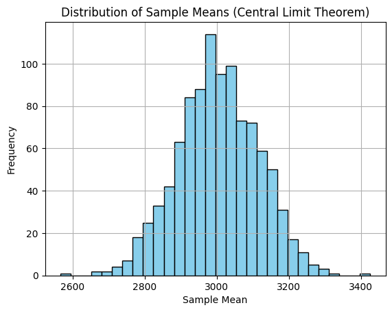
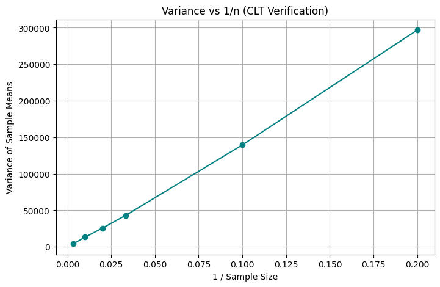
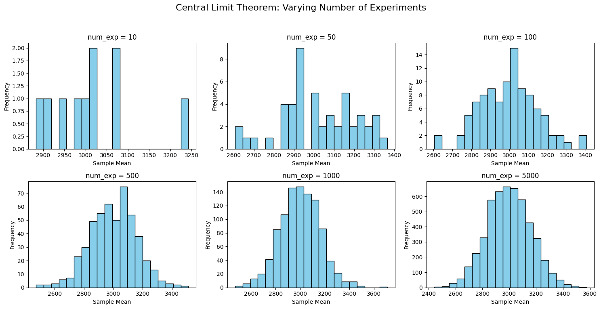
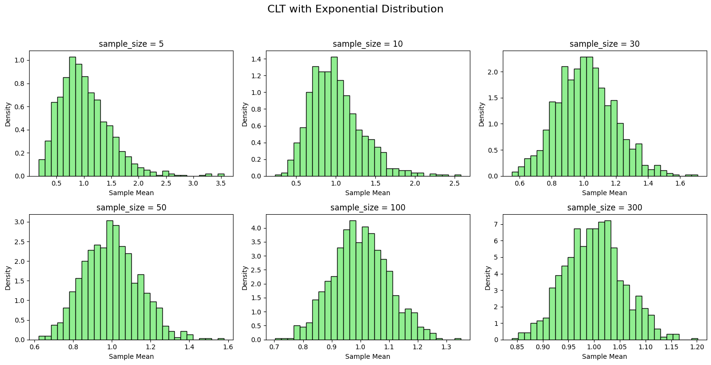
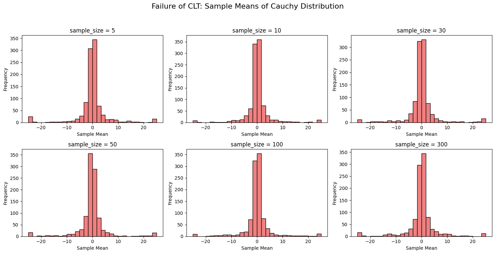

# Central Limit Theorem (CLT)

<!-- Table of Contents -->

> Data is messy. Kaggle might give you clean datasets to train models, but real life is far less “kaggly.” Distributions are rarely ideal or perfectly normal. Yet we often rely on the normal distribution to make decisions. This works thanks to the Central Limit Theorem (CLT). CLT underpins confidence intervals, hypothesis testing, and applying statistics to real‑world, not‑so‑ideal data. It’s useful across finance and risk modeling, A/B testing, and ML metrics, for example: model accuracy = 88.5% ± 1.2%.

### What is the Central Limit Theorem?

The CLT is about variability, population distributions, and averages.

***From any population, if you repeatedly draw random samples of a fixed size, the distribution of the sample means will be approximately normal (bell‑shaped), regardless of the original population’s distribution.***

Variables involved in CLT:

- Population size: N
- Sample size: n
- Number of experiments: X
In other words, choose samples of size n from a population of size N, repeat this X times, and record each sample mean. The distribution of those sample means tends toward normal.

Example: Choose heights of 100 people (n = 100) from a population of 10,000 (N = 10,000), repeat 1,000 times (X = 1,000), and record each mean.

### Assumptions and practical notes

- Samples are independent and randomly drawn from the same population.
- A sample size of n ≥ 30 is often “large enough” in practice.
- The population has finite variance.
- CLT does not require the original distribution to be normal.
A common confusion: we do not plot each experiment’s mean against experiment index. We look at the distribution of sample means, i.e., the frequency of the means themselves. Plotting the sequence of means over time won’t give a bell curve.

So: CLT is about distributions, not order. If you collect many sample means, their values will cluster around the population mean, and that clustering will be bell‑shaped. A histogram is a good way to see this.

```python
import numpy as np
import matplotlib.pyplot as plt

population = np.arange(1000, 5001)
sample_size = 100
num_exp = 1000

res_mean = []
for _ in range(num_exp):
    sample = np.random.choice(population, size=sample_size, replace=False)
    sample_mean = np.mean(sample)
    res_mean.append(sample_mean)

plt.hist(res_mean, bins=30, color='skyblue', edgecolor='black')
plt.title("Distribution of Sample Means (Central Limit Theorem)")
plt.xlabel("Sample Mean")
plt.ylabel("Frequency")
plt.grid(True)
```



---

### How sample size affects the CLT

Hold the number of experiments fixed, vary the sample size n.

```python
import numpy as np
import matplotlib.pyplot as plt

population = np.arange(1000, 5001)
num_exp = 1000
sample_sizes = [5, 10, 30, 50, 100, 300]

fig, axes = plt.subplots(2, 3, figsize=(15, 8))
axes = axes.flatten()

for i, sample_size in enumerate(sample_sizes):
    samples = np.random.choice(population, size=(num_exp, sample_size), replace=True)
    sample_means = samples.mean(axis=1)

    axes[i].hist(sample_means, bins=20, color='lightcoral', edgecolor='black')
    axes[i].set_title(f'sample_size = {sample_size}')
    axes[i].set_xlabel('Sample Mean')
    axes[i].set_ylabel('Frequency')

plt.suptitle("CLT: Varying Sample Size with num_exp = 1000", fontsize=16)
plt.tight_layout(rect=[0, 0.03, 1, 0.95])
```

Observations

- All distributions are centered near the population mean (~3000).
- The spread shrinks as the sample size increases.
- The bell shape appears even for modest sample sizes.

If $X_1, X_2, …, X_n$ are i.i.d. with mean μ and variance σ², then the sample mean

$$
\bar{X} = \frac{1}{n} \sum_{i=1}^{n} X_i
$$

has variance

$$
\operatorname{Var}(\bar{X}) = \frac{\sigma^2}{n}.
$$

Intuition: averaging cancels out random ups and downs. With more observations in each sample, noise cancels more effectively, so the distribution of sample means is tighter.

```python
import numpy as np
import matplotlib.pyplot as plt

population = np.arange(1000, 5001)
num_exp = 1000
sample_sizes = np.array([5, 10, 30, 50, 100, 300])

sample_means_var = []
inv_sample_sizes = 1 / sample_sizes

for sample_size in sample_sizes:
    samples = np.random.choice(population, size=(num_exp, sample_size), replace=True)
    sample_means = samples.mean(axis=1)
    variance = np.var(sample_means)
    sample_means_var.append(variance)

plt.figure(figsize=(8, 5))
plt.plot(inv_sample_sizes, sample_means_var, 'o-', color='teal')
plt.xlabel('1 / Sample Size')
plt.ylabel('Variance of Sample Means')
plt.title('Variance vs 1/n (CLT Verification)')
plt.grid(True)
```



Conclusion

The sample mean is an unbiased estimator of the population mean. With larger n, the sampling distribution narrows proportionally to 1/n.


---

### How the number of experiments affects the CLT

Keep sample size fixed and vary how many times you repeat the experiment (X). This affects how smooth the histogram looks, not its width.

```python
import random
import matplotlib.pyplot as plt

population = [i for i in range(1000, 5001)]
sample_size = 50
num_exp_values = [10, 50, 100, 500, 1000, 5000]

fig, axes = plt.subplots(2, 3, figsize=(15, 8))
axes = axes.flatten()

for i, num_exp in enumerate(num_exp_values):
    res_mean = []
    for _ in range(num_exp):
        sample = random.sample(population, k=sample_size)
        res_mean.append(sum(sample) / sample_size)

    axes[i].hist(res_mean, bins=20, color='skyblue', edgecolor='black')
    axes[i].set_title(f'num_exp = {num_exp}')
    axes[i].set_xlabel('Sample Mean')
    axes[i].set_ylabel('Frequency')

plt.suptitle("Central Limit Theorem: Varying Number of Experiments", fontsize=16)
plt.tight_layout(rect=[0, 0.03, 1, 0.95])
```



TL;DR

- Increasing sample_size narrows the bell (lower variance of sample means).
- Increasing num_exp makes the bell smoother (better resolution), not narrower.

---

### Skewed and heavy‑tailed distributions

Real‑world data can be skewed or heavy‑tailed. CLT still helps, but convergence can be slower, and there are cases where it fails.

### Exponential distribution

Right‑skewed, concentrated near zero, no hard upper bound. CLT works but needs larger n for symmetry to emerge.

```python
import numpy as np
import matplotlib.pyplot as plt

num_exp = 1000
sample_sizes = [5, 10, 30, 50, 100, 300]
scale = 1.0  # mean of the exponential distribution

fig, axes = plt.subplots(2, 3, figsize=(15, 8))
axes = axes.flatten()

for i, sample_size in enumerate(sample_sizes):
    samples = np.random.exponential(scale=scale, size=(num_exp, sample_size))
    sample_means = samples.mean(axis=1)

    axes[i].hist(sample_means, bins=30, color='lightgreen', edgecolor='black', density=True)
    axes[i].set_title(f'sample_size = {sample_size}')
    axes[i].set_xlabel('Sample Mean')
    axes[i].set_ylabel('Density')

plt.suptitle("CLT with Exponential Distribution", fontsize=16)
plt.tight_layout(rect=[0, 0.03, 1, 0.95])
```



Observation

At small n, histograms are skewed. As n increases, sample means become more symmetric and bell‑shaped.

### Cauchy distribution

The Cauchy has undefined mean and infinite variance. Here, the sample mean does not stabilize as n increases—the CLT assumptions break.

```python
import numpy as np
import matplotlib.pyplot as plt

num_exp = 1000
sample_sizes = [5, 10, 30, 50, 100, 300]

fig, axes = plt.subplots(2, 3, figsize=(15, 8))
axes = axes.flatten()

for i, sample_size in enumerate(sample_sizes):
    samples = np.random.standard_cauchy(size=(num_exp, sample_size))
    sample_means = samples.mean(axis=1)

    clipped_means = np.clip(sample_means, -25, 25)  # for visualization only

    axes[i].hist(clipped_means, bins=30, color='lightcoral', edgecolor='black')
    axes[i].set_title(f'sample_size = {sample_size}')
    axes[i].set_xlabel('Sample Mean')
    axes[i].set_ylabel('Frequency')

plt.suptitle("Failure of CLT: Sample Means of Cauchy Distribution", fontsize=16)
plt.tight_layout(rect=[0, 0.03, 1, 0.95])
```



Why CLT fails here

Even with larger n, the histogram remains fat‑tailed with extreme outliers. Some sample means are dominated by huge draws; averaging doesn’t stabilize because the variance is infinite.

---


